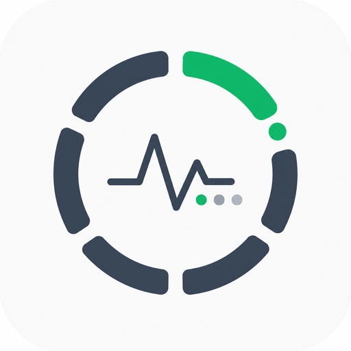
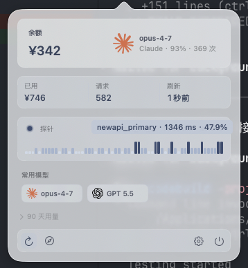
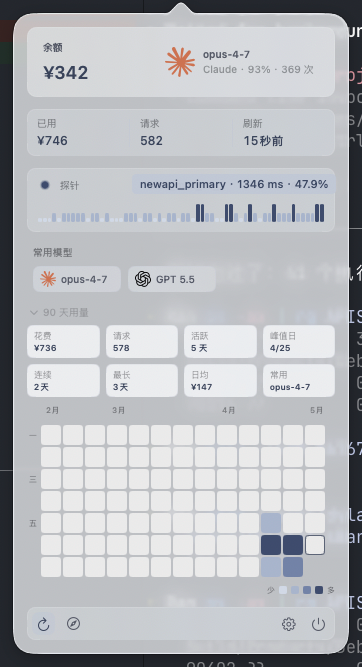
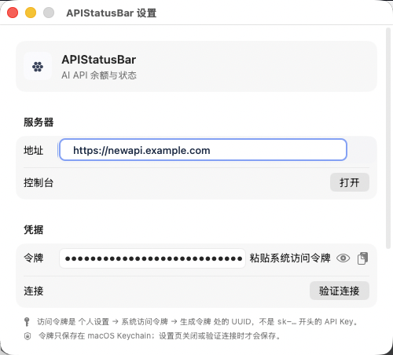

# APIStatusBar

<p align="center">
  
</p>

<p align="center">
  <strong>为 New API 打造的 macOS 菜单栏监控工具</strong>
</p>

<p align="center">
  <a href="https://github.com/Dylan-Nihilo/APIStatusBar/releases/latest"></a>
  
  
  
</p>

APIStatusBar 常驻 macOS 菜单栏，把 New API 网关的余额、请求量、服务探针、模型使用和 90 天消费热力图收进一个轻量弹窗。它面向需要长期盯 New API 状态的人：打开就能看余额是否充足、服务是否稳定、最近哪个模型在跑。

余额按网关实际返回金额展示，统一以人民币 `¥` 呈现，不做美元换算。

<p align="center">
  <a href="https://github.com/Dylan-Nihilo/APIStatusBar/releases/latest"><strong>下载最新版</strong></a>
  ·
  <a href="#首次配置">首次配置</a>
  ·
  <a href="#从源码运行">从源码运行</a>
</p>

## 界面

<p align="center">
  
  
</p>

<p align="center">
  
</p>

## 功能

| 模块 | 能力 |
| --- | --- |
| 菜单栏 | 常驻图标与余额摘要；低余额、连接异常时主动变色提醒 |
| 余额 | 展示当前余额、已用额度、请求数和最后刷新时间，金额以 RMB 原值显示 |
| 探针 | 持续检测网关可用性、延迟、24 小时可用率和最近心跳 |
| 模型 | 使用统一 provider icon + model name 展示常用模型，降低扫读成本 |
| 热力图 | 展开后查看 90 天花费、请求、活跃天数、峰值日和连续使用天数 |
| 设置 | 管理服务器地址、系统访问令牌、刷新间隔、低余额阈值和连接验证 |
| 安全 | 系统访问令牌保存在 macOS Keychain；应用只访问自己保存的这一项 |

## 下载安装

从 GitHub Release 下载 DMG：

- [APIStatusBar 最新版](https://github.com/Dylan-Nihilo/APIStatusBar/releases/latest)
- 下载 release asset 里的 `APIStatusBar-v<version>.dmg`

打开 DMG，把 `APIStatusBar.app` 拖到 `Applications`。首次启动如果 macOS 拦截，在 System Settings 里允许打开即可。

首次启动会自动打开设置窗口，并在 Dock 中显示，方便菜单栏拥挤时也能找到入口。配置完成后应用会切回菜单栏工具形态，不再常驻 Dock；之后从菜单栏图标进入主面板。

## 使用要求

- macOS 13.0 或更新版本
- 可访问的 New API 网关
- 控制台中的系统访问令牌

系统访问令牌不是 `sk-...` API Key。它来自 Web 控制台的个人设置，用于读取账户余额和使用状态。

## 首次配置

1. 启动 `APIStatusBar.app`，按照自动打开的启动引导填写配置。
2. 填入服务器地址，例如 `https://newapi.example.com`。
3. 在 Web 控制台生成系统访问令牌，复制后回到设置页粘贴或读取剪贴板。
4. 点击“验证连接”。
5. 验证通过后关闭设置页，菜单栏弹窗会自动刷新余额和状态。

如果菜单栏已有很多图标，APIStatusBar 图标可能被 macOS 挤到不可见区域。重新打开 `APIStatusBar.app` 会回到设置窗口；也可以按住 Command 将菜单栏图标拖到更靠右的位置，应用会让系统记住这个位置。

## 隐私与安全

- 应用不会读取浏览器 Cookie 或静默接管浏览器登录态。
- 令牌保存在 macOS Keychain 中，是为了重启后继续显示余额和用量，不需要用户每次重新粘贴。
- APIStatusBar 只读取和写入本应用保存的 `accessToken` 条目，不读取系统密码、浏览器密码或其他 Keychain 项目。
- 设置页粘贴令牌或连接验证时才会写入令牌。
- 余额、请求和模型数据来自你配置的网关地址。

## 从源码运行

源码工程由 XcodeGen 生成；未安装时先执行 `brew install xcodegen`。

```bash
git clone https://github.com/Dylan-Nihilo/APIStatusBar.git
cd APIStatusBar
xcodegen generate
open APIStatusBar.xcodeproj
```

在 Xcode 里运行 `APIStatusBar` scheme。启动后，菜单栏右侧会出现应用图标。

## 打包 Release DMG

```bash
scripts/package_dmg.sh
```

产物会写到 `dist/APIStatusBar-v<version>.dmg`，DMG 内包含 `APIStatusBar.app` 和 `Applications` 快捷方式。

## 项目结构

```text
APIStatusBar/
  APIStatusBarApp.swift          AppKit status item, popover and settings window
  Core/                          networking, polling, Keychain, formatting
  UI/                            SwiftUI popover, settings and dashboard
  UI/Dashboard/                  heatmap and usage widgets
APIStatusBarTests/               unit tests
Resources/Icons/                 provider icons from lobe-icons
```

## 测试

```bash
xcodebuild -project APIStatusBar.xcodeproj -scheme APIStatusBar test
```

Keychain 测试默认跳过，避免写入用户登录钥匙串。需要显式运行时设置：

```bash
APISTATUSBAR_RUN_KEYCHAIN_TESTS=1 xcodebuild -project APIStatusBar.xcodeproj -scheme APIStatusBar test
```

## Credits

Provider icons are from [lobehub/lobe-icons](https://github.com/lobehub/lobe-icons) under the MIT license.
